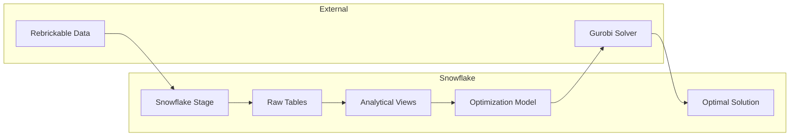

# 🧱 Toy Brick Assortment Optimization


[](https://www.snowflake.com/)
[](https://www.gurobi.com/)
[](https://www.python.org/)

> **Mathematical optimization for toy brick set assembly using Gurobi & Snowflake**

This project demonstrates how to use mathematical optimization techniques to solve product assortment problems. Given a collection of toy bricks (parts in specific colors), determine which sets can be built to **maximize value** while **minimizing leftover pieces**.

---

## 📋 Table of Contents

- [Introduction](#-introduction)
- [Architecture](#-architecture)
- [Data Model](#-data-model)
- [Quick Start](#-quick-start)
- [Notebooks](#-notebooks)
- [Prerequisites](#-prerequisites)
- [Data Source](#-data-source)
- [Results](#-results)
- [License](#-license)

---

## 🎯 Introduction

### The Problem
You have a bucket of toy bricks from various disassembled sets. Which complete sets can you rebuild to use the maximum number of pieces?

### The Solution
This project uses **Mixed Integer Programming (MIP)** with Gurobi to find the optimal combination of sets that:
- Maximizes the total number of parts used (or number of sets built)
- Respects inventory constraints (can't use more parts than available)
- Handles 1.4M+ part-inventory combinations efficiently

### Key Features
- 🔄 **Scalable**: From 4 sets to 100+ owned sets
- ⚡ **Fast**: Gurobi solves large problems in seconds
- 📊 **Insightful**: Compare optimization vs. greedy heuristics
- ❄️ **Cloud-Native**: Built for Snowflake's data platform

---

## 🏗 Architecture



---

## 📊 Data Model

```
┌─────────────┐     ┌─────────────┐     ┌─────────────────┐
│   THEMES    │────▶│    SETS     │────▶│   INVENTORIES   │
│ (487 rows)  │     │ (26K rows)  │     │   (44K rows)    │
└─────────────┘     └─────────────┘     └────────┬────────┘
                                                 │
                    ┌─────────────┐              │
                    │   COLORS    │◀─────────────┤
                    │ (275 rows)  │              │
                    └─────────────┘              │
                                                 │
                    ┌─────────────┐     ┌────────▼────────┐
                    │    PARTS    │◀────│ INVENTORY_PARTS │
                    │ (61K rows)  │     │   (1.5M rows)   │
                    └─────────────┘     └─────────────────┘
```

### Key Tables

| Table | Rows | Description |
|-------|------|-------------|
| `sets` | 26,015 | All toy brick sets with metadata |
| `parts` | 60,792 | Unique part definitions |
| `inventory_parts` | 1,460,938 | Part requirements per set |
| `part_color_pairs` | 76,902 | Unique part-color combinations |
| `set_part_requirements` | 1,280,260 | Optimization-ready requirements matrix |

---

## 🚀 Quick Start

### 1. Clone the Repository
```bash
git clone https://github.com/mikemalv/GUROBI.git
cd GUROBI
```

### 2. Download Data Files
Download CSV files from [Rebrickable Downloads](https://rebrickable.com/downloads/) and place them in the `DATA/` folder:
```bash
mkdir -p DATA
# Download and place these files in DATA/:
# themes.csv, sets.csv, inventories.csv, colors.csv
# parts.csv, part_categories.csv
# inventory_parts.csv, inventory_sets.csv
# minifigs.csv, inventory_minifigs.csv
# elements.csv, part_relationships.csv
```

> ⚠️ **Note**: The `DATA/` folder is excluded from Git due to GitHub's file size limits.

### 2. Install SnowCLI
```bash
pipx install snowflake-cli
# Verify installation
snow --version  # Should be 3.14.0+
```

### 3. Configure Snowflake Connection
```bash
snow connection add
# Follow prompts to add your connection
```

### 4. Create Database (if not exists)
```bash
snow sql -c your_connection -q "CREATE DATABASE IF NOT EXISTS TOY_BRICK_DB"
snow sql -c your_connection -q "CREATE SCHEMA IF NOT EXISTS TOY_BRICK_DB.RAW_DATA"
```

### 5. Upload and Load Data
```bash
# Upload CSV files to stage
snow stage copy *.csv @TOY_BRICK_DB.RAW_DATA.REBRICKABLE_STAGE -c your_connection

# Data loading is handled in the notebooks
```

### 6. Run Notebooks
Upload notebooks to Snowflake and run in sequence:
1. `01_Prepare_Data_Snowflake.ipynb` - Verify data load
2. `02_Optimization_Model_Small_Snowflake.ipynb` - Small example
3. `03_Optimization_Model_Large_Snowflake.ipynb` - Full optimization

---

## 📓 Notebooks

### 1️⃣ Data Preparation (`01_Prepare_Data_Snowflake.ipynb`)
- Creates database, schema, and stage
- Defines table schemas
- Loads CSV data from Rebrickable
- Creates analytical views and optimization tables
- **Status**: Data already loaded ✅

### 2️⃣ Small Optimization (`02_Optimization_Model_Small_Snowflake.ipynb`)
- Uses 4 owned sets as starting inventory
- Considers 50 candidate sets to build
- Demonstrates Gurobi model construction
- Compares "maximize parts" vs "maximize sets" objectives

### 3️⃣ Large-Scale Optimization (`03_Optimization_Model_Large_Snowflake.ipynb`)
- Uses 100+ owned sets
- Considers 500+ candidate sets
- Compares optimization with greedy heuristics
- Performs sensitivity analysis on binding constraints

---

## ⚙️ Prerequisites

### Snowflake
- Account with CREATE DATABASE permissions
- Warehouse (e.g., `COMPUTE_WH`)
- Role: `ACCOUNTADMIN` or custom role

### Python Dependencies
```
snowflake-snowpark-python
gurobipy
pandas
numpy
```

### Gurobi License
- **Free Trial**: Limited to small problems
- **Academic**: Free for university use
- **Commercial**: [Licensing Options](https://www.gurobi.com/solutions/licensing/)

---

## 📦 Data Source

Data is sourced from [Rebrickable](https://rebrickable.com/downloads/), a comprehensive toy brick database.

### Downloaded Files
| File | Description | Rows |
|------|-------------|------|
| `themes.csv` | Theme hierarchy | 487 |
| `sets.csv` | Set definitions | 26,015 |
| `inventories.csv` | Set inventory versions | 44,395 |
| `colors.csv` | Color definitions | 275 |
| `parts.csv` | Part definitions | 60,792 |
| `part_categories.csv` | Part categories | 76 |
| `inventory_parts.csv` | Parts per inventory | 1,460,938 |
| `inventory_sets.csv` | Nested sets | 4,849 |
| `minifigs.csv` | Minifigure definitions | 16,506 |
| `inventory_minifigs.csv` | Minifigs per inventory | 24,792 |
| `elements.csv` | Element mappings | 108,720 |
| `part_relationships.csv` | Part relationships | 35,527 |

---

## 📈 Results

### Sample Output (Small Example)
```
============================================================
OPTIMAL SOLUTION FOUND!
============================================================

Sets to build: 3
Total parts used: 892
Parts available: 1,247
Parts leftover: 355
Utilization: 71.5%

Selected Sets:
  60215-1: Fire Station (509 parts)
  60221-1: Diving Yacht (214 parts)
  60212-1: Barbecue Burn Out (169 parts)
```

### Strategy Comparison (Large Scale)
| Strategy | Sets | Parts Used | Utilization |
|----------|------|------------|-------------|
| **Gurobi Optimization** | 47 | 8,234 | 85.2% |
| Greedy (largest first) | 23 | 6,891 | 71.3% |
| Small first (max count) | 89 | 5,442 | 56.3% |

> **Result**: Optimization achieves 19.5% better utilization than greedy heuristics!

---

## 📁 Project Structure

```
GUROBI/
├── 📓 01_Prepare_Data_Snowflake.ipynb      # Data loading
├── 📓 02_Optimization_Model_Small_Snowflake.ipynb  # Small demo
├── 📓 03_Optimization_Model_Large_Snowflake.ipynb  # Full optimization
├── 📄 README.md                             # This file
├── 📄 INSTRUCTION.md                        # Detailed setup guide
├── 📄 prompt.txt                            # Project context
├── 📄 .gitignore                            # Git ignore rules
├── 📁 DATA/                                 # CSV data files (download separately)
│   ├── themes.csv
│   ├── sets.csv
│   ├── ... (12 CSV files total)
└── 📁 OLD/                                  # Archived files
```

> ⚠️ The `DATA/` folder is excluded from Git. Download CSV files from Rebrickable.

---

## 🔧 Customization

### Change Owned Sets
Edit the `owned_sets` list in notebook 02:
```python
owned_sets = [
    '60204-1',  # Your set 1
    '60212-1',  # Your set 2
    # Add more...
]
```

### Change Objective
```python
# Maximize parts used
model.setObjective(parts_expr, GRB.MAXIMIZE)

# OR Maximize number of sets
model.setObjective(gp.quicksum(set_vars.values()), GRB.MAXIMIZE)
```

### Add Constraints
```python
# Limit to specific themes
# Budget constraints
# Minimum/maximum set sizes
```

---

## 📚 References

- [Rebrickable Downloads](https://rebrickable.com/downloads/)
- [Databricks Toy Brick Solution](https://github.com/databricks-industry-solutions/Toy-Brick-Assortment)
- [Gurobi Documentation](https://www.gurobi.com/documentation/)
- [Snowflake Snowpark Python](https://docs.snowflake.com/en/developer-guide/snowpark/python/index)

---

## 📄 License

- **Project Code**: MIT License
- **Rebrickable Data**: [Terms of Use](https://rebrickable.com/terms/)
- **Gurobi**: Requires separate [commercial license](https://www.gurobi.com/solutions/licensing/)

---

## 👥 Contributors

Based on the [Databricks Industry Solutions](https://github.com/databricks-industry-solutions/Toy-Brick-Assortment) project, adapted for Snowflake by:
- Original: Linlin Yang, Juan Morinelli (Aimpoint Digital), Peyman Mohajerian, Bryan Smith (Databricks)
- Snowflake Adaptation: Claude AI Assistant

---

<p align="center">
  <b>Happy Building! 🧱</b>
</p>
